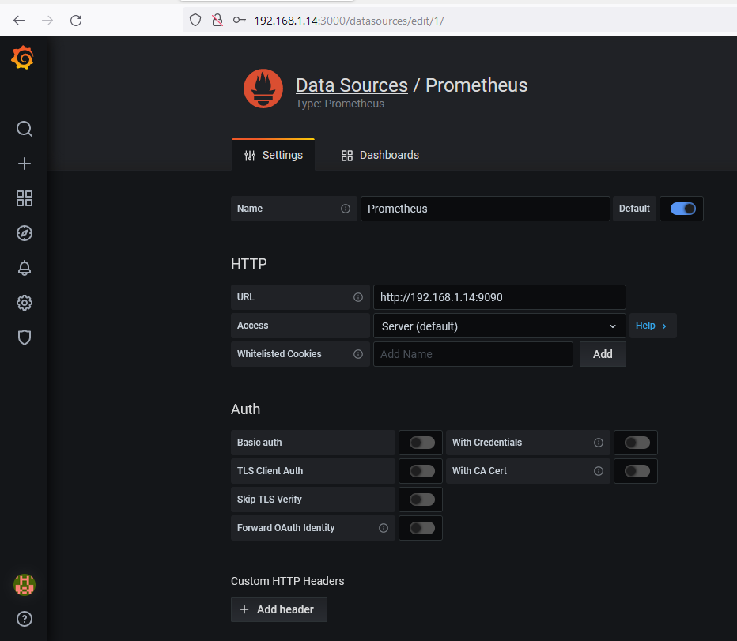
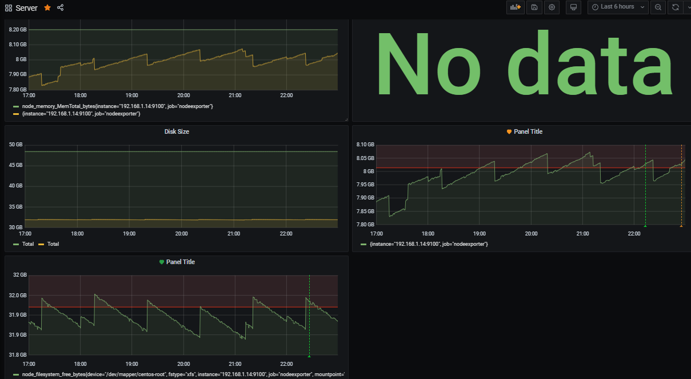
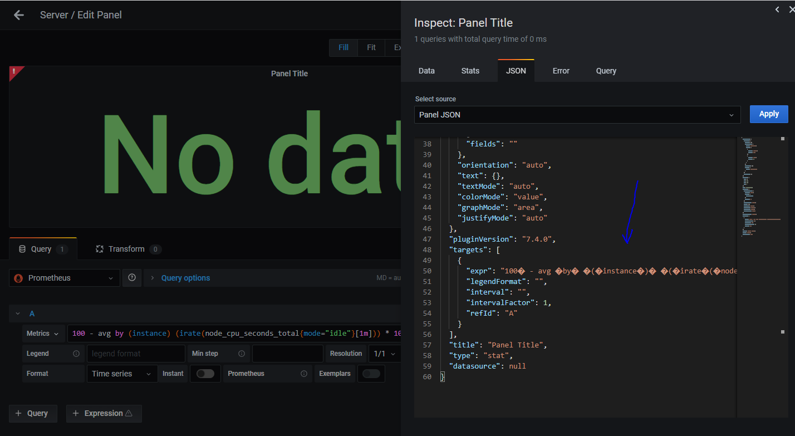
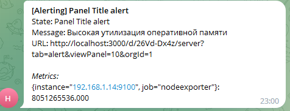

### Задание 1



### Задание 2 





#### Отобразить дешборд по CPU не удалось из за этой ошибки, пробовал в разных браузерах и кодировках вставлять\копировать, не помогло

[Проблема](https://community.grafana.com/t/parse-error-at-char-4-unexpected-character-ufeff/40704/5)





#### Утилизация CPU для nodeexporter (в процентах, 100-idle)
```
100 - avg by (instance) (irate(node_cpu_seconds_total{mode="idle"}[1m])) * 100
```
#### CPULA 1/5/15
```
100 - avg by (instance) (irate(node_cpu_seconds_total{mode="idle"}[1m])) * 100
```
```
100 - avg by (instance) (irate(node_cpu_seconds_total{mode="idle"}[5m])) * 100
```
```
100 - avg by (instance) (irate(node_cpu_seconds_total{mode="idle"}[15m])) * 100
```
#### Количество места на файловой системе
```
node_filesystem_size_bytes{device="/dev/mapper/centos-root",fstype="xfs",mountpoint="/"}
```
```
node_filesystem_free_bytes{device="/dev/mapper/centos-root",fstype="xfs",mountpoint="/"}
```
#### Количество свободной оперативной памяти
```
node_memory_MemTotal_bytes
```
```
node_memory_MemTotal_bytes - node_memory_MemFree_bytes
```
### Задание 3 



### Задание 4

[JSON](json.txt)


