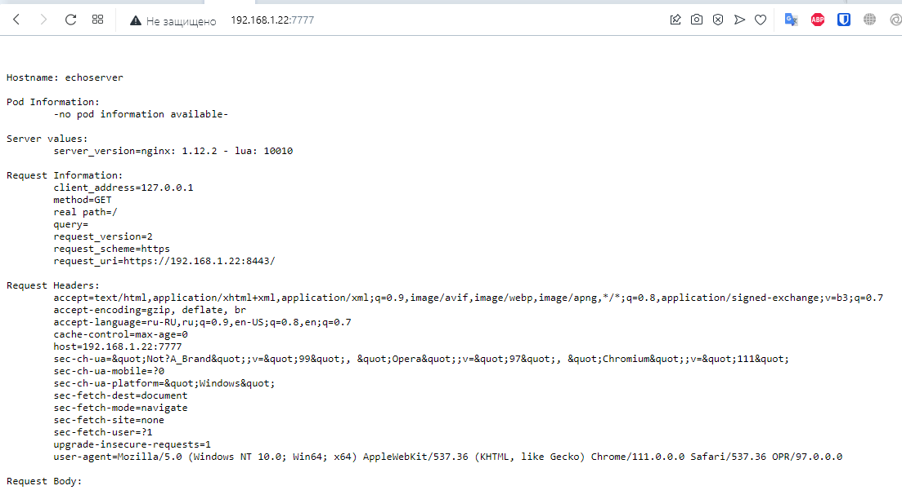
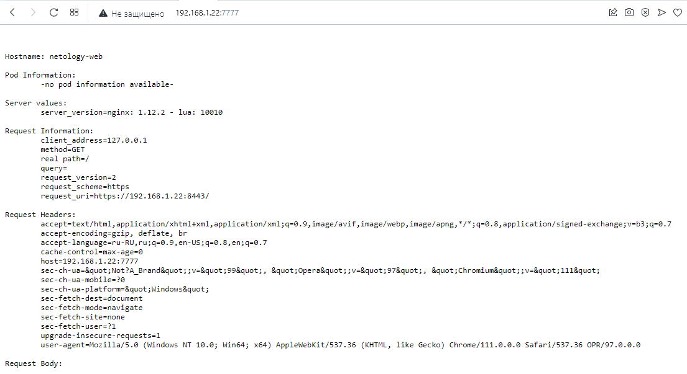
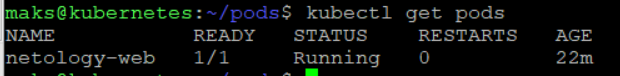

## Задание 1 Pods



```
apiVersion: v1
kind: Pod
metadata:
  name: echoserver
spec:
  containers:
  - name: echoserver
    image: gcr.io/kubernetes-e2e-test-images/echoserver:2.2
    ports:
    - containerPort: 8443
```

## Задание 2 Service



```
apiVersion: v1
kind: Pod
metadata:
  name: netology-web
  labels:
    app.kubernetes.io/name: netology-web
spec:
  containers:
  - name: netology-web
    image: gcr.io/kubernetes-e2e-test-images/echoserver:2.2
    ports:
      - containerPort: 8443
        name: http-web-svc

---
apiVersion: v1
kind: Service
metadata:
  name: netology-svc
spec:
  selector:
    app.kubernetes.io/name: netology-web
  ports:
  - name: echoserver
    protocol: TCP
    port: 9090
    targetPort: http-web-svc
```

#### kubectl get pods


