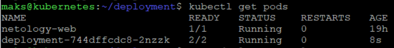
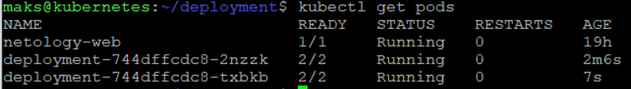
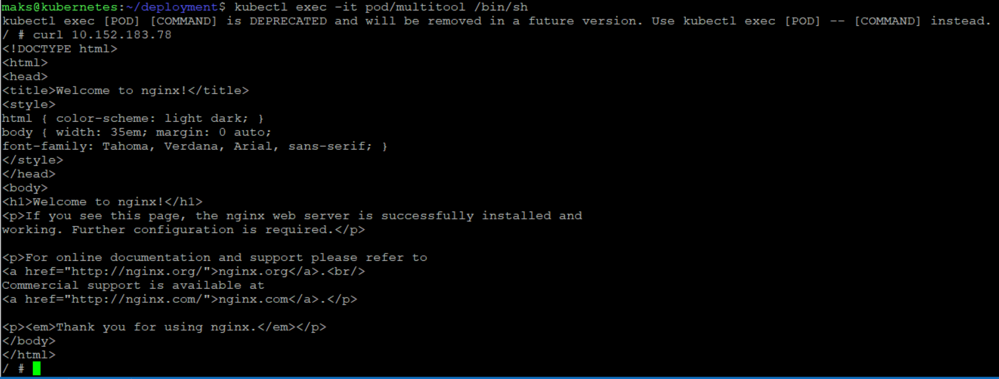
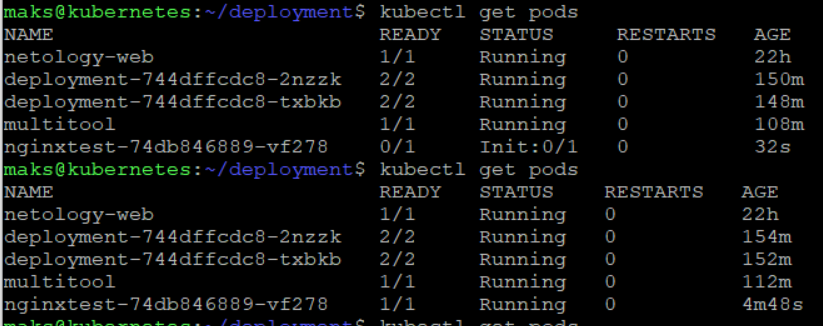

## Задание 1 

#### Deployment

```
apiVersion: apps/v1
kind: Deployment
metadata:
  name: deployment
  labels:
    app: nginx
spec:
  replicas: 2
  selector:
    matchLabels:
      app: dep
  template:
    metadata:
      labels:
        app: dep
    spec:
      containers:
      - image: nginx:latest
        name: nginx
        ports:
        - containerPort: 80
      - image: docker.io/wbitt/network-multitool:latest
        name: multitool
        ports:
        - containerPort: 1180
        env:
        - name: HTTP_PORT
          value: "1180"
```

#### Колличество pod до масштабирования



#### Колличество pod после масштабирования 



#### Service

```
apiVersion: v1
kind: Service
metadata:
  name: dep
spec:
  ports:
  - name: nginx
    protocol: TCP
    port: 80
  - name: multitool
    protocol: TCP
    port: 1180
  selector:
    app: dep
```

#### Pod multitool

```
apiVersion: v1
kind: Pod
metadata:
  name: multitool
spec:
  containers:
  - name: multitool
    image: docker.io/wbitt/network-multitool:latest
    env:
    - name: HTTP_PORT
      value: "1280"
```

#### Запрос Curl внутри контейнера 



## Задание 2

#### Deployment

```
apiVersion: apps/v1
kind: Deployment
metadata:
  name: nginxtest
  labels:
    app: test
spec:
  replicas: 1
  selector:
    matchLabels:
      app: test
  template:
    metadata:
      labels:
        app: test
    spec:
      containers:
      - image: nginx:latest
        name: nginx
        ports:
        - containerPort: 80
      initContainers:
      - name: init-nginx
        image: docker.io/library/busybox:latest
        command: ['sh', '-c', 'until nslookup test.default.svc.cluster.local; do echo waiting for test; sleep 3; done;']
```

#### Service

```
apiVersion: v1
kind: Service
metadata:
  name: test
spec:
  ports:
  - name: nginx
    protocol: TCP
    port: 80
  selector:
    app: test
```

#### Состояние pod до и после запуска service


