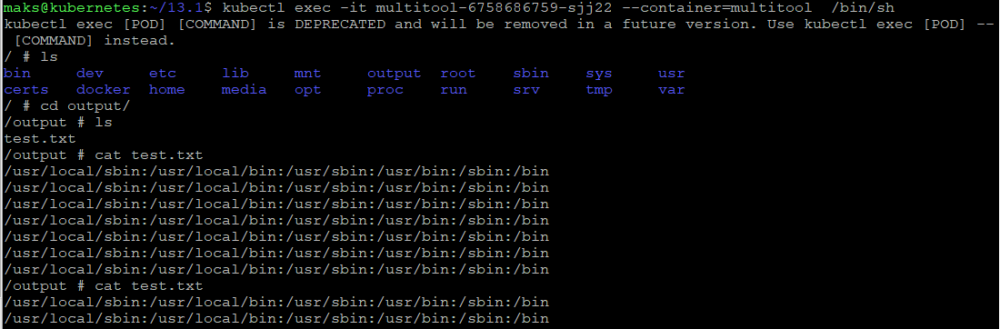
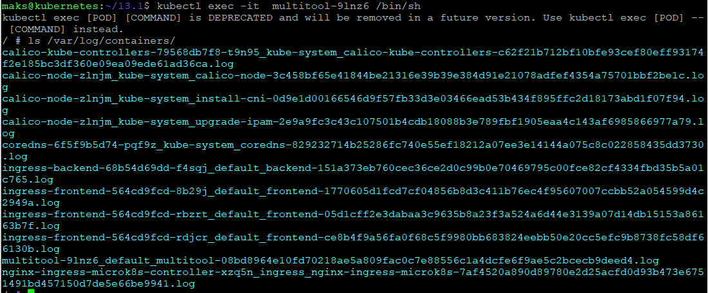

## Задание 1

#### deployment "busybox и multitool"

```
apiVersion: apps/v1
kind: Deployment
metadata:
  name: multitool
  labels:
    app: multitool
spec:
  replicas: 1
  selector:
    matchLabels:
      app: multitool
  template:
    metadata:
      labels:
        app: multitool
    spec:
      containers:
      - image: busybox
        name: bussybox
        command: ['sh', '-c', 'while true; do echo $PATH >> /input/test.txt; sleep 5s; done']
        volumeMounts:
        - mountPath: /input
          name: bussybox-multitool
      - image: docker.io/wbitt/network-multitool:latest
        name: multitool
        volumeMounts:
        - mountPath: /output
          name: bussybox-multitool
      volumes:
        - name: bussybox-multitool
          emptyDir: {}
```

#### Чтение лога после применения deployment



## Задание 2

#### DaemonSet

```
apiVersion: apps/v1
kind: DaemonSet
metadata:
  name: multitool
  labels:
    app: multitool
spec:
  selector:
    matchLabels:
      app: multitool
  template:
    metadata:
      labels:
        app: multitool
    spec:
      containers:
      - image: docker.io/wbitt/network-multitool:latest
        name: multitool
        volumeMounts:
        - mountPath: /var/log
          name: varlog
      volumes:
      - name: varlog
        hostPath:
          path: /var/log
```

#### Чтение логов после применения DaemonSet


