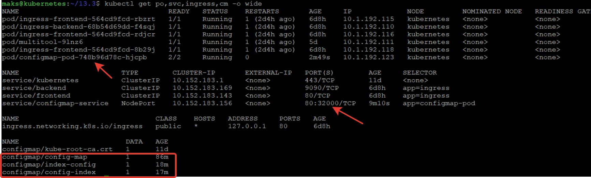
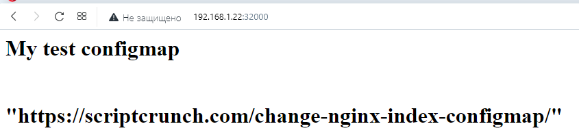
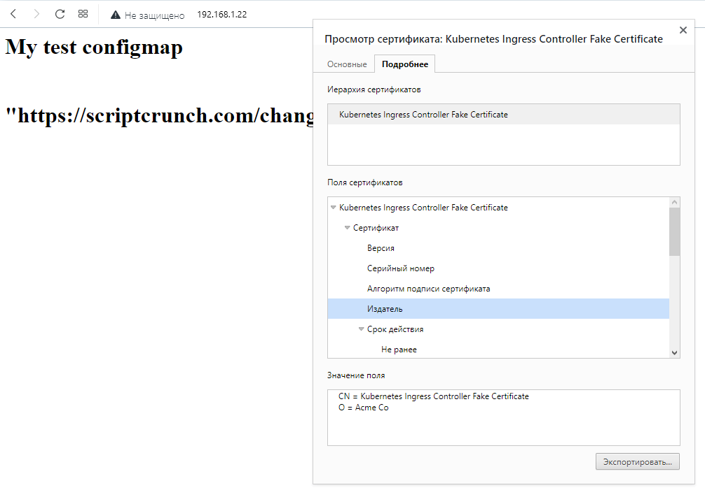

## Задание 1

#### 1.1 Deployment приложения, состоящего из контейнеров busybox и multitool

```
apiVersion: apps/v1
kind: Deployment
metadata:
  name: configmap-pod
  labels:
    app: configmap-pod
spec:
  replicas: 1
  selector:
    matchLabels:
      app: configmap-pod
  template:
    metadata:
      labels:
        app: configmap-pod
    spec:
      containers:
      - image: busybox
        name: bussybox
        command: ['sh', '-c', 'while true; do echo $PATH >> /input/test.txt; sleep 5s; done']
      - image: docker.io/wbitt/network-multitool:latest
        name: multitool
        volumeMounts:
        - name: index
          mountPath: /usr/share/nginx/html/
        env:
        - name: configmap
          valueFrom:
            configMapKeyRef:
              name: config-map
              key: HTTP_PORT
      volumes:
      - name: index
        configMap:
          name: config-index
```

#### 1.3 Продемонстрировать, что pod стартовал и оба конейнера работают




#### 1.4 Сделать простую веб-страницу и подключить её к Nginx с помощью ConfigMap. Подключить Service и показать вывод curl или в браузере





#### 1,4 Service, ConfigMap

```
apiVersion: v1
kind: ConfigMap
metadata:
  name: config-index
data:
  index.html: |
    <html>
    <h1>My test configmap</h1>
    </br>
    <h1> "https://scriptcrunch.com/change-nginx-index-configmap/" </h1>
    </html>
---
apiVersion: v1
kind: ConfigMap
metadata:
  name: config-map
data:
  HTTP_PORT: "9090"
---
apiVersion: v1
kind: Service
metadata:
  name: configmap-service
spec:
  type: NodePort
  ports:
  - name: multitool
    protocol: TCP
    port: 80
    targetPort: 80
    nodePort: 32000
  selector:
    app: configmap-pod
```

## Задание 2

#### Создать Deployment приложения, состоящего из Nginx


```
apiVersion: apps/v1
kind: Deployment
metadata:
  name: nginx
  labels:
    app: nginx
spec:
  replicas: 1
  selector:
    matchLabels:
      app: nginx
  template:
    metadata:
      labels:
        app: nginx
    spec:
      containers:
      - image: nginx:latest
        name: nginx
        ports:
        - containerPort: 80
        volumeMounts:
        - name: index
          mountPath: /usr/share/nginx/html/
      volumes:
      - name: index
        configMap:
          name: nginx
```

#### Выпустить самоподписной сертификат SSL,создать Secret для использования сертификата,создать Ingress и необходимый Service, подключить к нему SSL в вид ingress, service, secret, configmap

```
apiVersion: networking.k8s.io/v1
kind: Ingress
metadata:
  name: nginx
  annotations:
    nginx.ingress.kubernetes.io/rewrite-target: /
spec:
  rules:
  - http:
      paths:
      - path: /
        pathType: Prefix
        backend:
          service:
            name: nginx
            port:
              number: 80
  tls:
  - hosts:
    - 10.152.183.48
    secretName: my-cert
---
apiVersion: v1
kind: Service
metadata:
  name: nginx
spec:
  selector:
    app: nginx
  type: NodePort
  ports:
    - name: http
      port: 80
      nodePort: 32000
      targetPort: 80
---
apiVersion: v1
kind: ConfigMap
metadata:
  name: nginx
apiVersion: v1
kind: ConfigMap
metadata:
  name: nginx
data:
  index.html: |
    <html>
    <h1>My test configmap</h1>
    </br>
    <h1> "https://scriptcrunch.com/change-nginx-index-configmap/" </h1>
    </html>
---
apiVersion: v1
items:
- apiVersion: v1
  data:
    tls.crt: LS0tLS1CRUdJTiBDRVJUSUZJQ0FURS0tLS0tCk1JSURhekNDQWxPZ0F3SUJBZ0lVTmhvTkRQK2pOS3Nad2I3UFI1Z2pmOHZ3Rjg0d0RRWUpLb1pJaHZjTkFRRUwKQlFBd1JURUxNQWtHQTFVRUJoTUNRVlV4RXpBUkJnTlZCQWdNQ2xOdmJXVXRVM1JoZEdVeElUQWZCZ05WQkFvTQpHRWx1ZEdWeWJtVjBJRmRwWkdkcGRITWdVSFI1SUV4MFpEQWVGdzB5TXpBMU1UUXdPVFV6TkRkYUZ3MHpNekExCk1URXdPVFV6TkRkYU1FVXhDekFKQmdOVkJBWVRBa0ZWTVJNd0VRWURWUVFJREFwVGIyMWxMVk4wWVhSbE1TRXcKSHdZRFZRUUtEQmhKYm5SbGNtNWxkQ0JYYVdSbmFYUnpJRkIwZVNCTWRHUXdnZ0VpTUEwR0NTcUdTSWIzRFFFQgpBUVVBQTRJQkR3QXdnZ0VLQW9JQkFRRG5mYUx2ZVpmK1YzTWlESTdIZnIxbkxKRCt3SWhRWTVBUng0cVRGZjMwCjFMZnc3NW1MNTJLeWFWVlFLUDhweHI3d1haRUNscVlUbXRlc1dsWUJGM2xmUEh3Y2hQTzMyWnpNQ3VXMkIydU4KNzBaMmZQa1dUZEhnQnhaMGE3dlllMG5mZStxM1oxNnA3RGVDTWRoQW93ejJUZVd1ckluY0tnNVhDOGQ2S0x5TAoxeHNwMGZEdm9DZFMvMXJ0TUNPM3IxRnlIWTJsLytkQmdLTVI0a2YvT085amQvRmlVR3hpdzlLYytqVkljWUd5ClNCaDlZNUxEcW5WNUJnSU5uZXpZS3RRaDRiWHh4Q3ZaNHFMNG5KTXNMejdyaG4vL3pvdFZQdmU3U1hFYzNWMUQKMS9acVEzeXk3R0d6QTlsdHYwWTdCcVVBbUxjV1RzWlFDU0JUVzJ0aFhIemRBZ01CQUFHalV6QlJNQjBHQTFVZApEZ1FXQkJUNlplK1VnNXhFc3E4SkR3eHJlVXBaeDZaUTFUQWZCZ05WSFNNRUdEQVdnQlQ2WmUrVWc1eEVzcThKCkR3eHJlVXBaeDZaUTFUQVBCZ05WSFJNQkFmOEVCVEFEQVFIL01BMEdDU3FHU0liM0RRRUJDd1VBQTRJQkFRQjEKWlh2aFVnWHBjU04yM00wNWdxaGUveC9oY0ZtQUxHYmVvRXBjazgzTE85a2ZTVDVpdGhxc3ZYSVcyK0Z1aE1OSwpuNHliNUtQVGszcm1TSitXSS9HUGcrMjJxZjdJOGVHRkhjRDlxWjA0VWRxQjB2b0xUMHFGdVRCS2I2WUlGNHJ1CkxlLzU0am43Z1RSK25JQ29SWHloQXoxaWExTHQ2N0RtS0VXd0Yzell5TVgwOFVEV0ptaDhNblBJVnRoY3lOWmIKY0JGVFRKSlRneVhUaDNiTXNtS0c3ekwzUGdOQkpNWnpWSFBKc2wwd1lhbmZJQVZJS0YrNldCUy82RS9CZWExcApFbGtWRktWUnlteDA0b2dnMHJjYlZGMFR5eWxxcGtpV2EySjNaN3BRak9sNWhYdkN2cjMrRVNLMWJVWFBIRGE2CkFJdmtRYTdVMWpEWmVmTENVR1EwCi0tLS0tRU5EIENFUlRJRklDQVRFLS0tLS0K
    tls.key: <скрыто>
  kind: Secret
  metadata:
    creationTimestamp: "2023-05-14T10:08:07Z"
    name: my-cert
    namespace: default
    resourceVersion: "1617438"
    uid: fc2ad5e9-66d4-4d30-a6ca-002dfa101f93
  type: kubernetes.io/tls
kind: List
metadata:
  resourceVersion: ""
```

#### WebHTTPS


