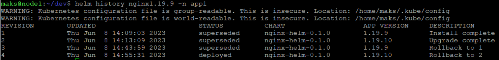
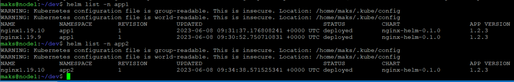
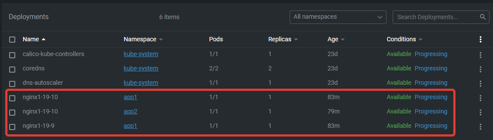

## Задание 1

#### Полностью пушить все 3 версии приложения не буду тк там меняются только значения в vars и имя деплоя в heml

[Chart](nginx/Chart.yaml)

[values](nginx/values.yaml)

[deployment](nginx/templates/deployment.yaml)

### helm history, сделал тестовый rollback

## Задание 2

#### Helm list

#### deployment в OpenLens

