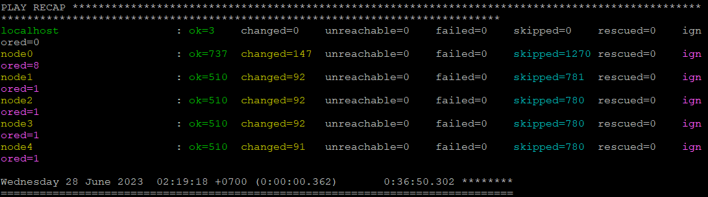
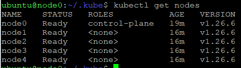
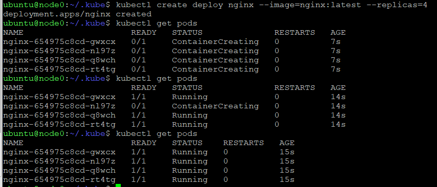
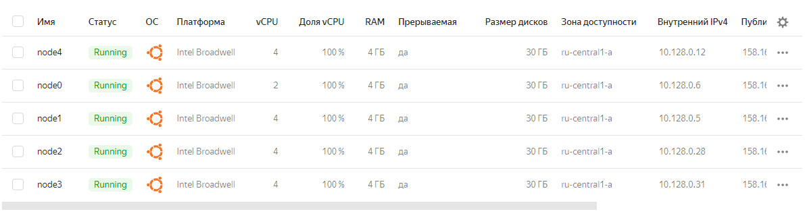

### Выполненный Playbook



### Подключаемся к мастер ноде и копируем config file
```
mkdir -p $HOME/.kube
sudo cp -i /etc/kubernetes/admin.conf $HOME/.kube/config
sudo chown $(id -u):$(id -g) $HOME/.kube/config
```

### Делаем запрос



### Проверяем работу кластера с контейнером nginx



### Скрин машин с YC




### Файлы Terraform 

[Terraform](terraform)