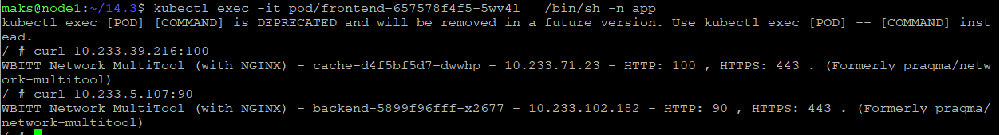
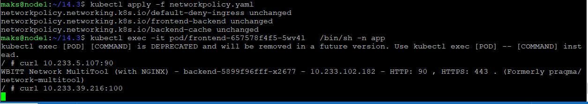
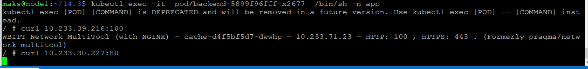

### Создаем deployment

[Deployment](deployment.yaml)

### Создаем Service

[Service](service.yaml)

### Проверяем доступность с дефолтной политикой frontend-backend, frontend-cache

### Применяем networkpolicy

[Service](networkpolicy.yaml)

### Проверяем доступность frontend-backend, frontend-cache не работает как и должно

### Проверяем доступность backend-cache, backend-frontend не работает как и должно

