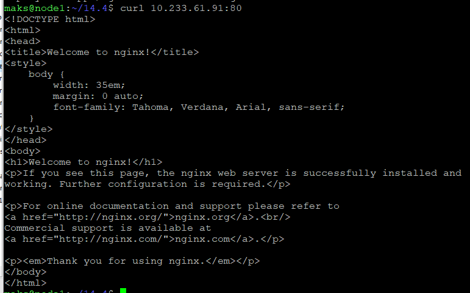
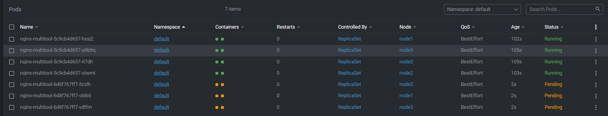
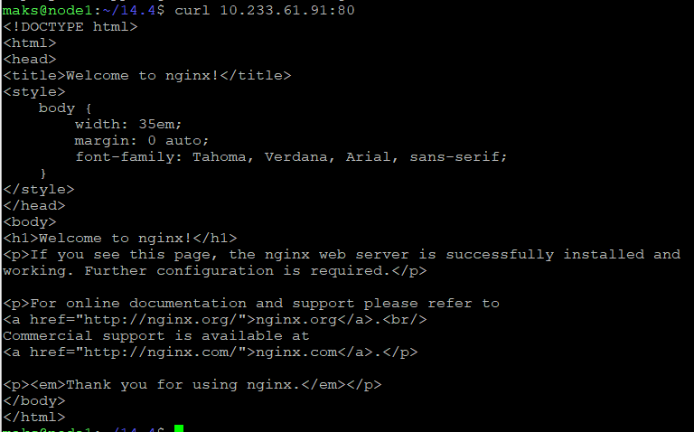
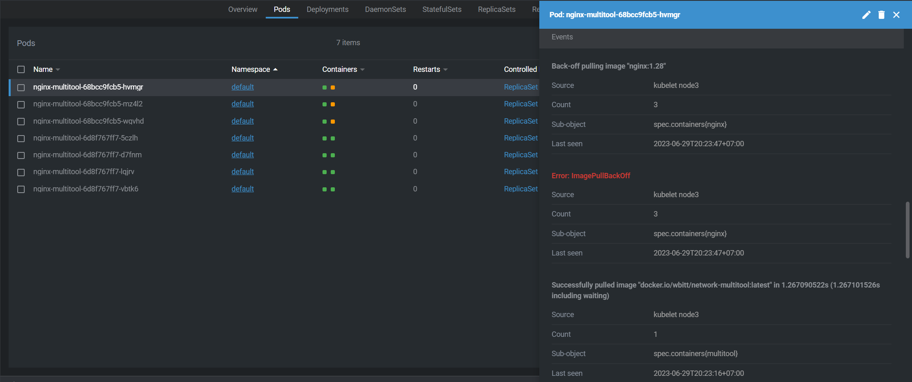
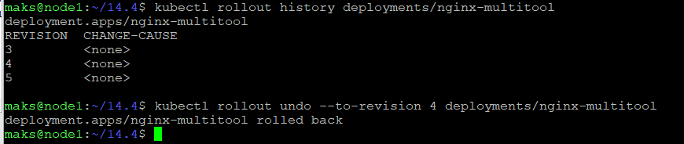
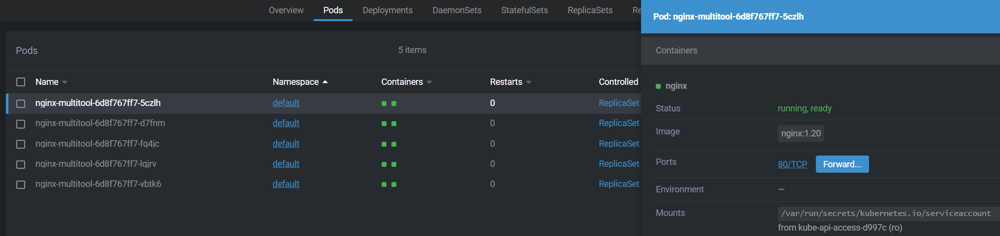

## Задание 1

### Здесь подходит как Rolling update так и Recreate update, исходя из задачи у нас есть 20% запаса мощности при минимальной нагрузке, а когда будет минимальная нагрузка никогда не угадаешь, в задании не сказано ничего про постоянную доступность приложения, значит более подходящая схема это  Recreate update, сразу пересоздастся pod с новой версией приложения, так же можно использоваться  Rolling update с указанием параметров maxSurge maxUnavailable когда нужна доступность приложения, но здесь нужно угадать момент обновления иначе ресурсов на создание нового pod может не хватить 

## Задание 2

### Делаем deployment и service

```
apiVersion: apps/v1
kind: Deployment
metadata:
  name: nginx-multitool
  labels:
    app: nginx-multitool
spec:
  replicas: 5
  strategy:
    type: RollingUpdate
    rollingUpdate:
      maxSurge: 25%
      maxUnavailable: 25%
  selector:
    matchLabels:
      app: nginx-multitool
  template:
    metadata:
      labels:
        app: nginx-multitool
    spec:
      containers:
      - image: nginx:1.28
        name: nginx
        ports:
        - containerPort: 80
      - image: docker.io/wbitt/network-multitool:latest
        name: multitool
        ports:
        - containerPort: 100
        env:
        - name: HTTP_PORT
          value: "100"
```

### Service

```
apiVersion: v1
kind: Service
metadata:
  name: nginx-multitool
spec:
  ports:
  - name: nginx
    protocol: TCP
    port: 80
    targetPort: 80
  selector:
    app: nginx-multitool
```

### Проверяем работоспособность nginx



### Обновляем версию до 1.20, смотрим что происходит обновление 



### Проверяем curl что все работает



### Обновляем nginx до версии 1.28, видим что поды не поднялись а прошлая версия продолжает работать




### Смотрим историю версий и откатываемся на предыдущую 



### Проверяем доступность старой версии приложения

