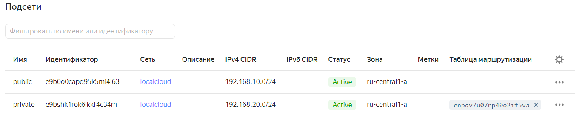
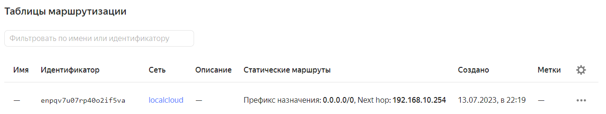
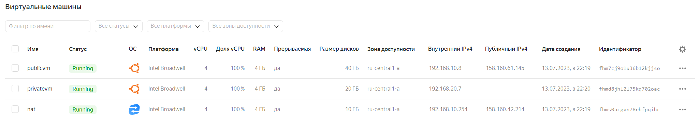
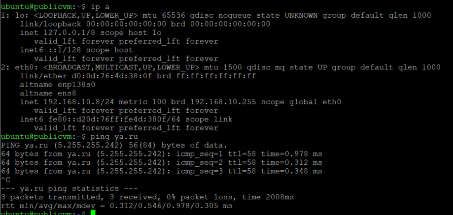
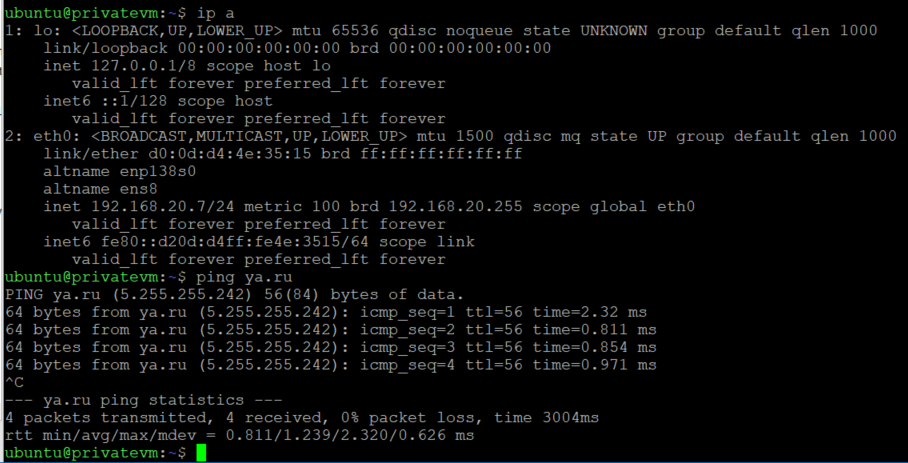

### Файлы Terraform 

[Terraform](terraform)

### Смотрим созданную инфраструктуру в YC

### Заходим на public vm и проверяем доступ в интернет 

### Копируем ключ на public_vm с terraform машины заходим на private_vm проверяем доступ в интернет

