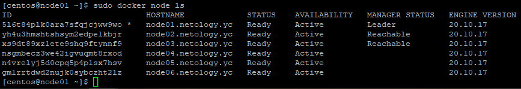
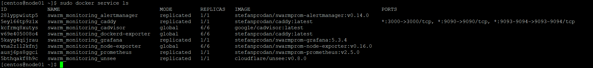

# В чём отличие режимов работы сервисов в Docker Swarm кластере: replication и global?
## В режиме global на каждой рабочей ноде будет развернуто гарантировано по 1 сервису, в режиме  replication на  n нодах могут быть развернуты n реплики  сервисов 

# Какой алгоритм выбора лидера используется в Docker Swarm кластере?
## Алгоритм Raft, почитав документацию я понял это примерно так : лидер ищет у кого более точная информация тот и лидер, в общем применяется принцип идемпотентности.

# Что такое Overlay Network?
## Overlay — виртуальная сеть туннелей, натянутая поверх физической сети, она позволяет ВМ одного клиента общаться друг с другом,при этом обеспечивая изоляцию от других клиентов, в общем грубо говоря это vpn тунели между серверами и необязательно которые находятся в одной физической сети

## Docker node

## Docker service

