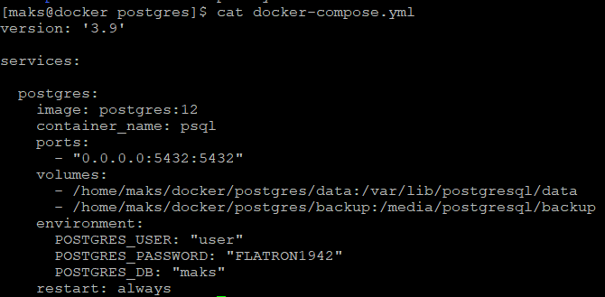
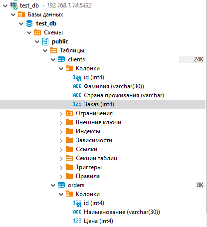
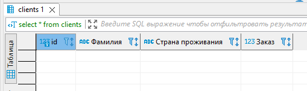
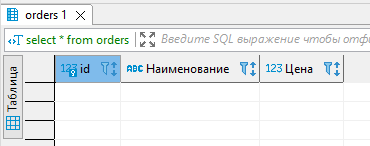
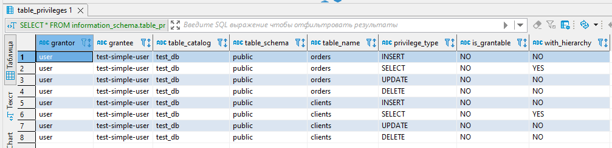
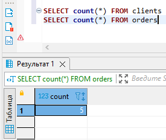
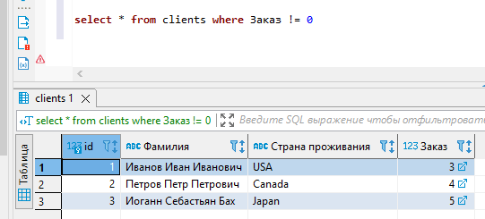
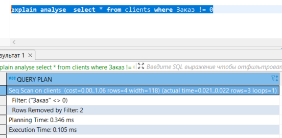
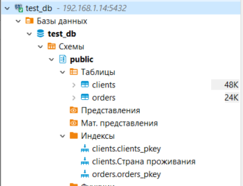

## Задача 1
### Docker-compose файл:

## Задача 2
### Итоговый список БД:

### Описание таблицы clients:

### Описание таблицы orders:

### SQL запрос для выдачи списка пользователей:

SELECT * FROM information_schema.table_privileges where grantee = 'test-simple-user'

### Вывод списока пользователей с правами на test_db:

## Задача 3
### Запросы для вычисления количества записей для каждой таблицы:

SELECT count(*) FROM clients
SELECT count(*) FROM orders

### Результат выполнения:

## Задача 4
### Связываем записи в таблицах:

update clients set Заказ = 3 where id = 1
update clients set Заказ = 4 where id = 2
update clients set Заказ = 5 where id = 3

### Делаем запрос:

select * from clients where Заказ != 0

### Результат:

## Задача 5
### Получаем полную информацию по выполнению запроса:

explain analyse  select * from clients where Заказ != 0

### Расшифровка:

### Ccost Приблизительная стоимость запуска. Это время, которое проходит, прежде чем начнётся этап вывода данных и приблизительная общая стоимость
### Rows Ожидаемое число строк, которое должен вывести этот узел плана
### Width Ожидаемый средний размер строк, выводимых этим узлом плана
### Вывод: Чем меньше данные результаты тем быстрее и эффективнее выполняется запрос

### Результат выполнения:

## Задача 6

### Делаем buckup текущей базы:
pg_dump -U user test_db -f /media/postgresql/backup/base

### Делаем восстановление базы:
psql -U user -W test_db < /media/postgresql/backup/base

### Проверяем backup:

