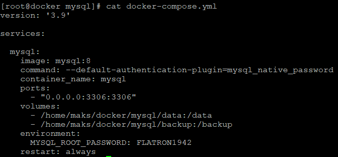
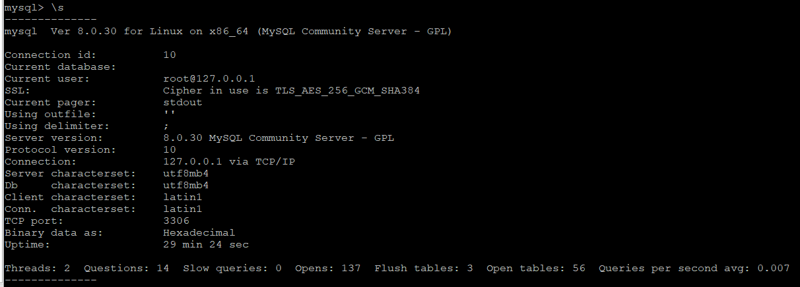
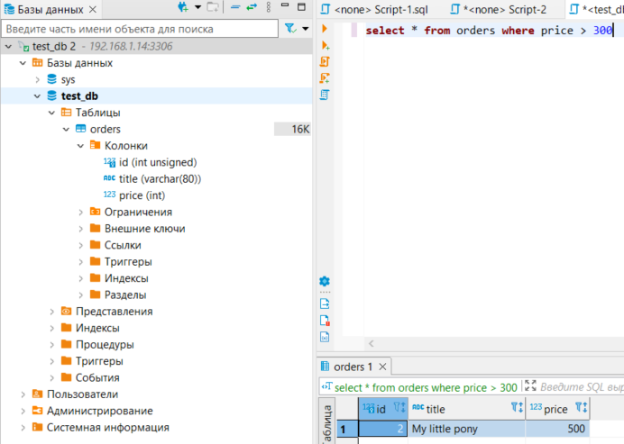
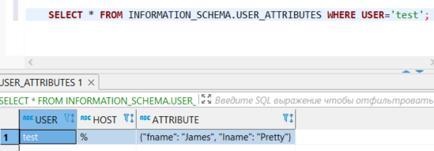
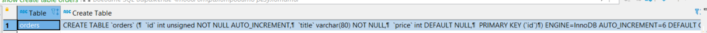
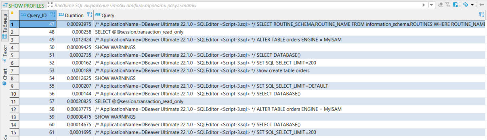
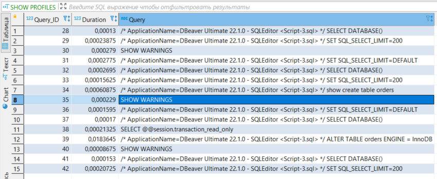
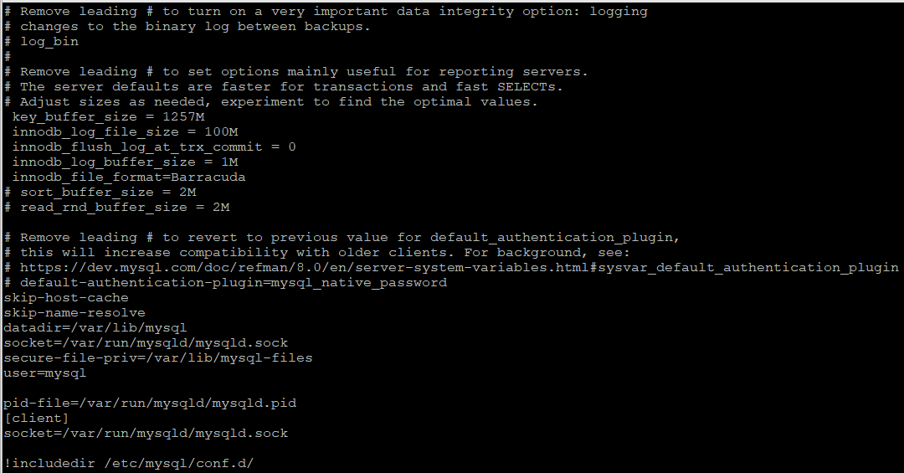

## Задача 1
### Docker compose file:

### Статус БД \s :

### Колличество записей price > 300:

## Задача 2
### SQL запросы:

CREATE USER test

 ALTER USER test
    IDENTIFIED BY 'test-pass'
    WITH
    MAX_QUERIES_PER_HOUR 100
    PASSWORD EXPIRE INTERVAL 180 DAY
    FAILED_LOGIN_ATTEMPTS 3
    ATTRIBUTE '{"fname": "James", "lname": "Pretty"}';

GRANT select on orders to "test"

SELECT * FROM INFORMATION_SCHEMA.USER_ATTRIBUTES WHERE USER='test';

### Результат:

## Задача 3:
### SQL запросы:

show create table orders

### Меняем движок в таблицах:

ALTER TABLE orders ENGINE = InnoDB;
ALTER TABLE orders ENGINE = MyISAM;

### MyISAM:

### InnoDB:

## Задача 4:
### my.cnf:

