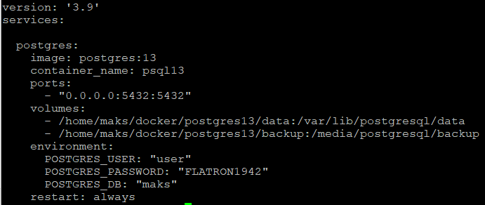
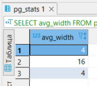
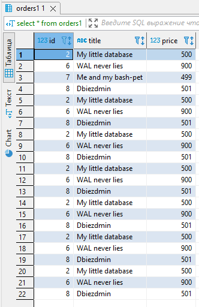
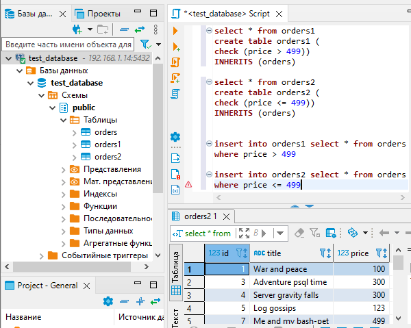

## Задача 1
### Docker compose file:

### Управляющие команды SQL:

### вывода списка БД: \l
### подключения к БД: \c 
### вывода списка таблиц: \dt 
### вывода описания содержимого таблиц: \d
### выхода из psql: \q

## Задача 2
### Запрос SQL:

	select avg_width from pg_stats where tablename='orders'

### Результат:

## Задача 3
### Запрос SQL:

	select * from orders1
	create table orders1 (
	check (price > 499))
	INHERITS (orders)

	create table orders2 (
	check (price <= 499))
	INHERITS (orders)

	insert into orders1 select * from orders
	where price > 499

	insert into orders2 select * from orders
	where price <= 499

### Результат:

### orders 1

### orders 2

### Можно ли было изначально исключить "ручное" разбиение при проектировании таблицы orders:

### Можно, нужно было при создании таблицы сделать ее секционной, разбив секцию на price > 499 и price <=499

## Задача 4
### Делаем бэкап:

	pg_dump -U user -W test_database > /media/postgresql/backup/test_database.dump

### Можно создать индекс для эффективного регистронезависимого поиска:

	CREATE INDEX ON orders ((lower(title)))

