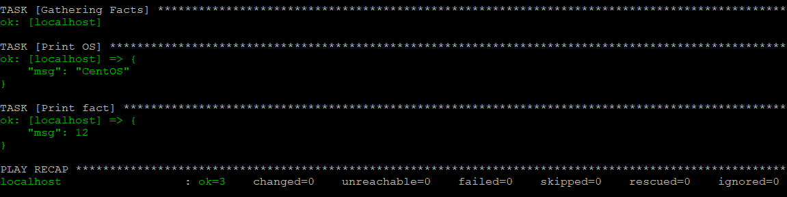
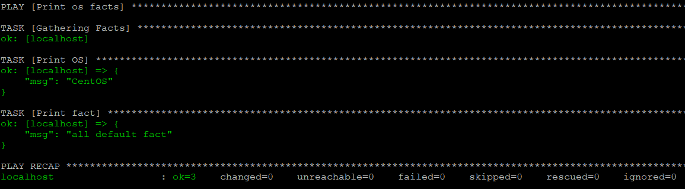
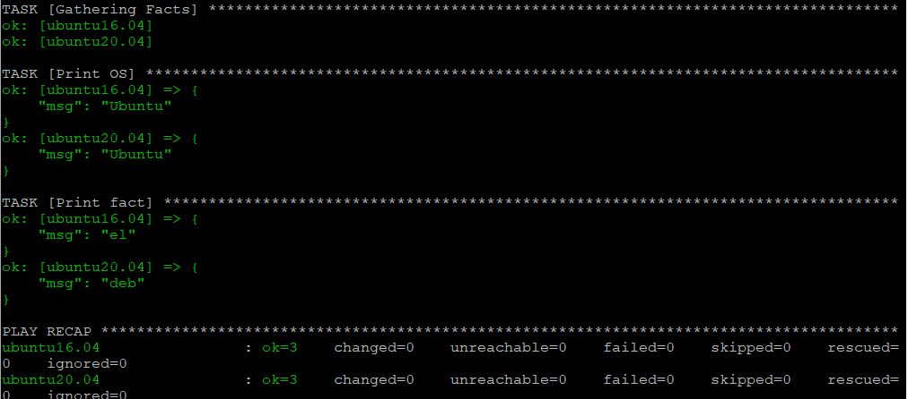
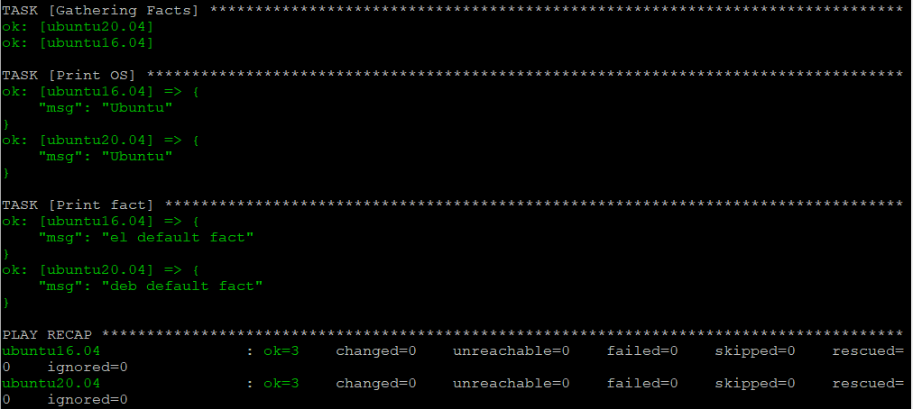
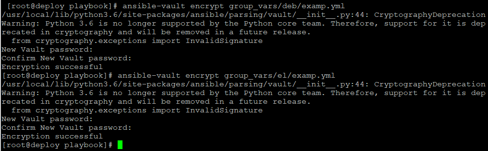
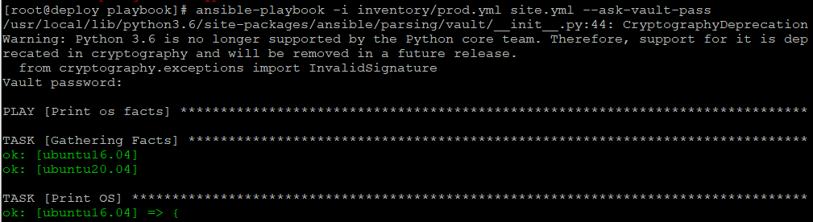
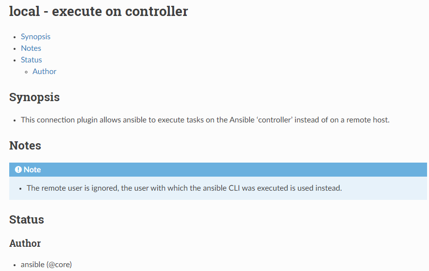
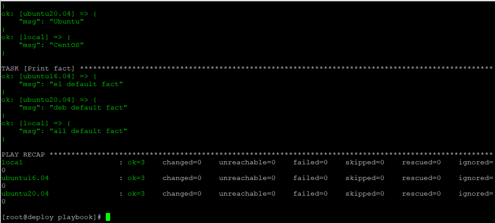

## Задание 1



## Задание 2



## Задание 3

### Делал подключение в локальной сети к своим виртуальным машинам на Ubuntu 1.24, 1.25

## Задание 4



## Задание 5

### Дописал значения в deb и el

## Задание 6



## Задание 7



## Задание 8



## Задание 9

### Не нашел ничего с помощью команды ansible-doc но нешел в оф мануале ansible



## Задание 10

```
---
  el:
    hosts:
      ubuntu16.04:
        ansible_host: 192.168.1.24
        ansible_user: user
        ansible_password: user
  deb:
    hosts:
      ubuntu20.04:
        ansible_host: 192.168.1.25
        ansible_user: user
        ansible_password: user
  local:
   hosts:
    local:
      ansible_host: 127.0.0.1
      ansible_user: maks
      ansible_password: 1
```
## Задание 11



