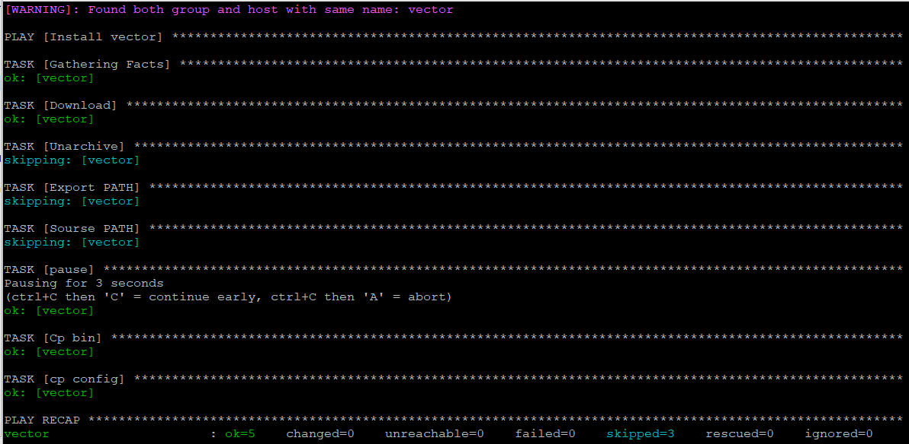
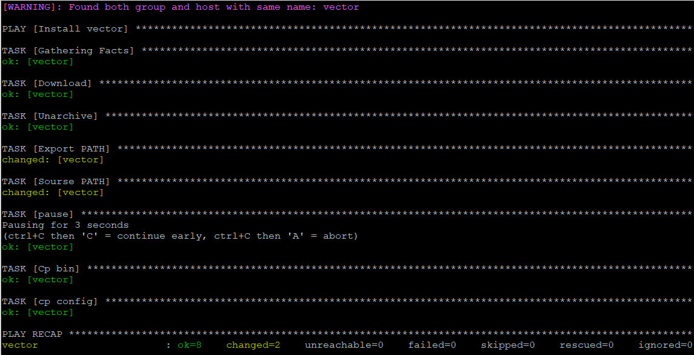

## Данный playbook скачивает у устанавливает vector нужной вам версии
### Для выбора нужной версии vector отредактируйте playbook\group_vars\vector\vars.yml
### После выполнения playbook можно настроить конфиг, для этого отредактируйте файл /vector-x86_64-unknown-linux-gnu/config/vector.toml, после редактирования запустите  playbook с тегом "reconfig" 

#### 3. При создании tasks рекомендую использовать модули: `get_url`, `template`, `unarchive`, `file`. (Использовал модули get_url, unarchive,shell,pause,copy )

#### 4.  Запустите `ansible-lint site.yml` и исправьте ошибки, если они есть. (ошибок не обнаружено)

#### 6. Попробуйте запустить playbook на этом окружении с флагом `--check`.

#### 7. Запустите playbook на `prod.yml` окружении с флагом `--diff`. Убедитесь, что изменения на системе произведены.

#### 8. Повторно запустите playbook с флагом `--diff` и убедитесь, что playbook идемпотентен.(Результат идемпотентен)

