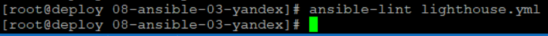
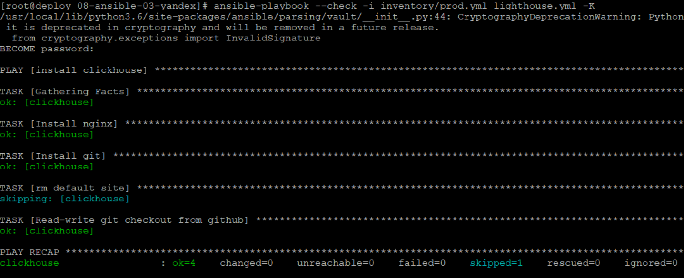
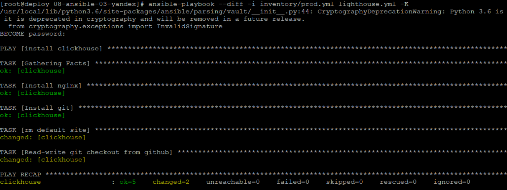
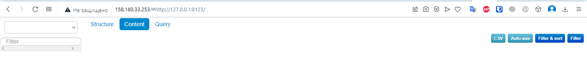

### Данный playbook устанавливает nginx, git, lighthouse, тегов не предусмотрено
#### Опционально: создает образ диска с помошью packer, подготавливвет инфраструктуру с помощью terraform

### 2 При создании tasks рекомендую использовать модули: get_url, template, yum, apt (Использовал shell, git, apt)

### 4 Приготовьте свой собственный inventory файл prod.yml

```
---
  lighthouse:
    hosts:
      clickhouse:
        ansible_host: 158.160.33.253
        ansible_user: ubuntu
```
### 5 Запустите ansible-lint site.yml и исправьте ошибки, если они есть (ошибок не обнаружено)



### 6 Попробуйте запустить playbook на этом окружении с флагом --check



### 7 Запустите playbook на prod.yml окружении с флагом --diff. Убедитесь, что изменения на системе произведены.



### 8 Повторно запустите playbook с флагом --diff и убедитесь, что playbook идемпотентен (playbook идемпотентен)

### 9 Работающий lighthouse:

 


